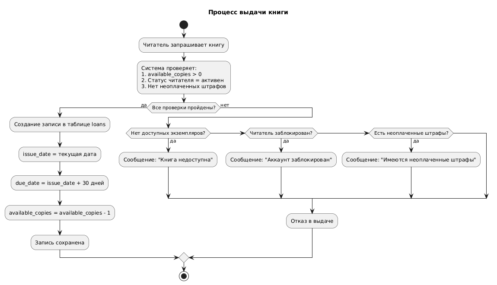
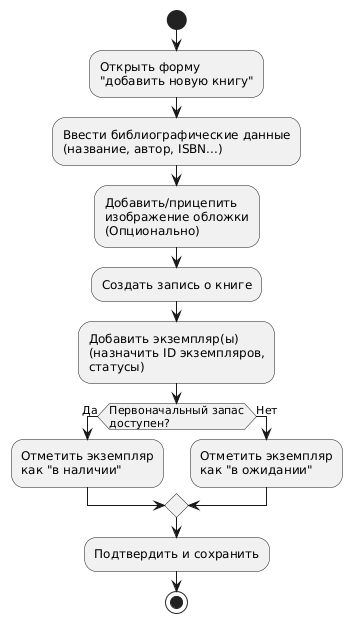
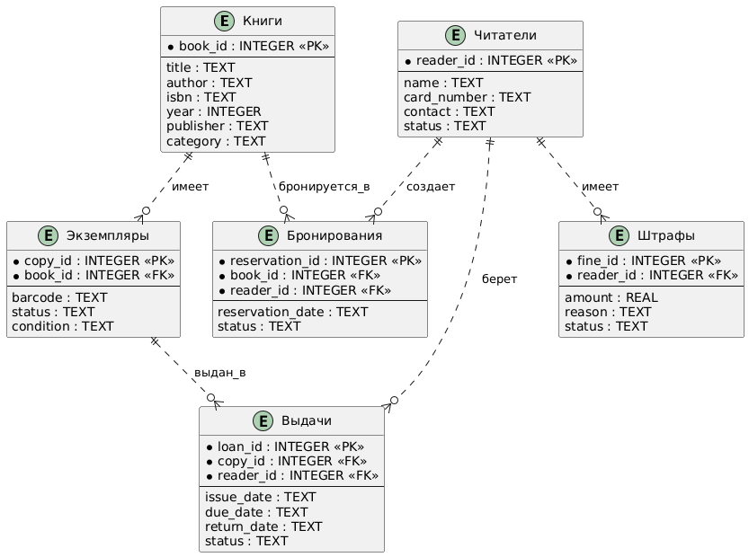

# Система учёта книг в библиотеке

## Описание проекта
Система для автоматизации учёта книг в библиотеке, включающая функции каталогизации, поиска, выдачи книг и управления читателями.

## Основной функционал
- **Управление книгами**: добавление, редактирование, удаление книг и экземпляров
- **Поиск по каталогу**: по названию, автору, ISBN, жанру
- **Управление читателями**: регистрация, блокировка/разблокировка
- **Операции выдачи/возврата**: оформление выдачи, контроль сроков
- **Бронирование книг**: резервирование и уведомления
- **Штрафная система**: учёт и оплата штрафов
- **Отчётность**: статистика по выдачам и популярности книг

## Пользователи системы
### Читатель (Reader)
- Поиск и просмотр книг
- Бронирование книг
- Продление срока
- Просмотр истории выдач и штрафов

### Библиотекарь (Librarian)
- Управление книгами (добавление/редактирование/удаление)
- Оформление выдачи и возврата книг
- Формирование отчётов
- Управление читателями
- Начисление штрафов

### Диаграмма Use Case


## Блок-схемы процессов

### Процесс выдачи книги


### Процесс добавления новой книги


## Технологии
- Python
- Git & GitHub
- PlantUML для диаграмм

## Запуск проекта
```bash
python src/main.py
```

## Структура проекта
```
InfProject/
├── .gitignore
├── README.md
├── src/
│   └── main.py
└── docs/
    ├── diagrams/
    │   ├── reader_do.puml
    │   └── librarian_do.puml
    └── images/
        ├── reader_do.png
        └── librarian_do.png
```

## База данных

### ER-диаграмма


### Описание сущностей:
- **Книги (Book)** - информация о книгах (название, автор, ISBN и т.д.)
- **Экземпляры (Copy)** - физические копии книг с уникальными штрихкодами
- **Читатели (Reader)** - зарегистрированные пользователи библиотеки
- **Выдачи (Loan)** - записи о выдаче книг читателям
- **Бронирования (Reservation)** - резервирование книг
- **Штрафы (Fine)** - система штрафов за просрочки

### Типы связей:
- **Книги → Экземпляры**: один-ко-многим (1 книга имеет N экземпляров)
- **Экземпляры → Выдачи**: один-ко-многим (1 экземпляр выдается много раз)
- **Читатели → Выдачи**: один-ко-многим (1 читатель берет много книг)

### Используемые технологии
- SQLite - встраиваемая СУБД
- Python sqlite3 - для работы с базой данных
- PlantUML - для создания диаграмм